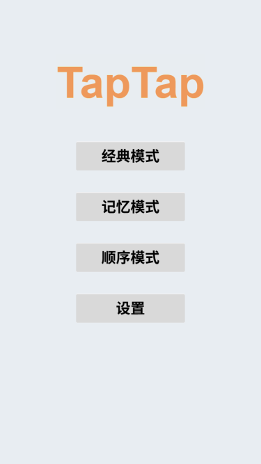
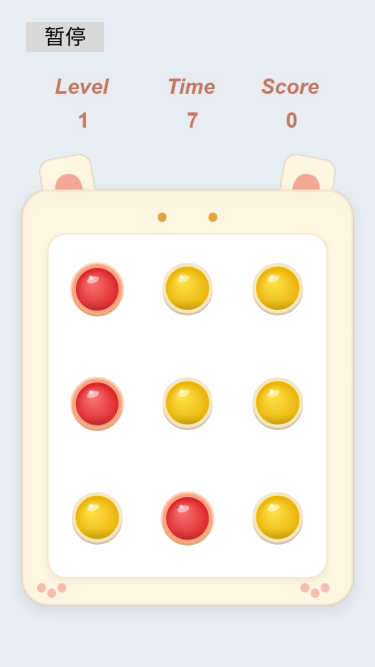

# Rhythm Bubbles

🎮 **Rhythm Bubbles** 是一款休闲益智小游戏，玩家需要在有限时间内，根据关卡规则快速判断并点击正确的泡泡，在反应与思考之间取得平衡，获得更高分数。

本项目基于 **Cocos Creator 3.4.2** 开发，作为一个结构清晰、易于理解的小游戏示例，初学勿喷！

---

## ✨ 游戏特点

- 轻松休闲，操作简单
- 关卡 + 时间 + 分数机制
- 清晰的 UI 与即时反馈
- 完整的音频管理与场景切换流程
- 适合作为 Cocos Creator 学习与开源示例项目

---

## 📸 游戏截图

### 主菜单界面

### 游戏界面

---

## 🛠 技术栈

- **引擎**：Cocos Creator 3.x
- **语言**：TypeScript
- **平台**：Web / 小游戏平台（可扩展）